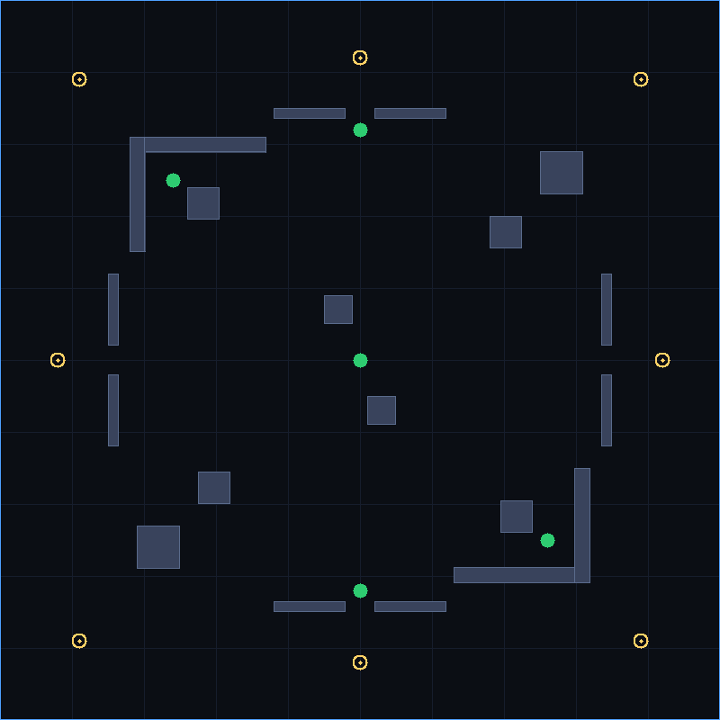

# Cow Map (`cowmap`)

The first themed map for Vertix Reboot — a farm/pasture arena that recreates the
*gameplay feel* of Vertix Online's Cow Map. No original Vertix assets, textures,
or map data are used; the layout below is our own, built only from the engine's
own primitives (axis-aligned `RectWall` cover, `spawnPoints`, `healthPacks`).



> Legend: dark blocks = walls (cover / line-of-sight blockers), green dots =
> health packs, yellow rings = spawn points. Grid lines every 200 units.

## Dimensions

| | |
|---|---|
| Map id | `cowmap` |
| Size | **2000 × 2000** units (matches `WORLD`) |
| Mode | FFA (first to 1500, or top score at 4:00) |
| Classes | Triggerman, Hunter, Vince (all supported) |
| Symmetry | 180° rotational (FFA-fair) |

Keeping the map at exactly `WORLD` (2000²) means the camera bounds, background
grid and minimap scaling need no special-casing — only the walls, spawns and
health packs differ from other maps.

## Layout & combat zones

The arena reads as a farm: two **barns** on the NW↘SE diagonal, **silo
clusters** on the NE↙SW diagonal, an open **central pasture**, and **gated
perimeter fences** that form edge rotation lanes.

| Zone | Geometry | Combat role / risk-reward |
|------|----------|---------------------------|
| **Central pasture** | Mostly open; two small offset cover blocks at (900,820) and (1020,1100) | Long N–S / E–W sightlines reward the **Hunter (sniper)**. Holding it is high-reward but fully exposed — high risk. The offset blocks give just enough duck-behind cover to avoid a pure death-field. |
| **Barn NW** | L of walls open toward center: north (360,380,380×44) + west (360,380,44×320), interior hay-bale (520,520,90×90) | Close-quarters pocket favouring **Vince (shotgun)**; cuts the longest NW↘ diagonal so snipers can't hold corner-to-corner. |
| **Barn SE** | 180° mirror: south (1260,1576,380×44) + east (1596,1300,44×320), bale (1390,1390,90×90) | Same role on the opposite diagonal. |
| **Silo cluster NE** | (1500,420,120²) + (1360,600,90²) | Mid-range cover that breaks the NE↙ diagonal and frames the north/east lanes — **Triggerman** territory. |
| **Silo cluster SW** | (380,1460,120²) + (550,1310,90²) | Mirror of NE. |
| **Perimeter lanes** | Fence pairs with a centred gate gap on each side (e.g. north (760,300,200×30) + (1040,300,200×30); gate from x≈960–1040) | Safer rotation routes between spawns; the gates are pinch points good for shotgun/MG ambushes. |

### Flow

Edge/corner **spawns** feed into the perimeter lanes and side clusters, then
funnel inward to the contested pasture. The two barns sit on the route between
diagonal spawns and the center, so pushing mid usually means passing a
close-quarters structure — mirroring the Cow Map's barn-and-field rhythm.

## Spawn points (8)

Anti-spawn-kill picks the point farthest from the nearest living enemy
(`ArenaRoom.pickSpawn`). All sit outside the fence ring, away from center.

```
Corners:  (220,220)  (1780,220)  (220,1780)  (1780,1780)
Edges:    (1000,160) (1000,1840) (160,1000)  (1840,1000)
```

## Health packs (5)

+50 heal on contact, respawn after a cooldown (`HEALTH_PACK.RESPAWN_MS`, default
15 s; env `HP_RESPAWN_MS`).

| Location | Risk / reward |
|----------|---------------|
| (1000,1000) — center pasture | Most contested, fully exposed; biggest gamble. |
| (480,500) — NW barn mouth | Safer; rewards holding the barn. |
| (1520,1500) — SE barn mouth | Mirror. |
| (1000,360) — north lane | Mid risk, on a rotation route. |
| (1000,1640) — south lane | Mirror. |

## How it plugs into the map system

- **Data:** `COWMAP: MapDef` in `packages/shared/src/maps.ts`, registered in
  `MAPS` and resolved by `getMap("cowmap")`.
- **Server:** `ArenaRoom` loads `getMap(MAP_ID ?? "cowmap")` (Cow Map is now the
  default; set `MAP_ID=arena01` to load the older arena) and publishes the
  active id via `MatchState.map`.
- **Client:** `ArenaScene` and `Minimap` read `match.map` and render
  `getMap(match.map)` — no map is hardcoded, so any registered map renders and
  collides correctly. Client prediction collides against the active map's walls.

## Assumptions (original Cow Map data unavailable)

The original Vertix Online Cow Map layout is **not preserved in this repo** and
no authoritative coordinates/screenshots were available, so the specific
geometry here is a **good-faith reconstruction of the *feel***, not a 1:1 copy:

1. **Theme over fidelity.** "Barns", "silos", "hay bales" and "fences" are
   thematic names for plain `RectWall` cover; there are no textures/props yet
   (the renderer draws flat blocks). Art/props are future work.
2. **Layout is invented.** Exact wall sizes, spawn and pack coordinates are
   tuned for balanced FFA flow and the three current classes, not extracted from
   the original. They were chosen to deliver *similar* sightlines (long across
   the pasture), combat distances (CQB in barns, mid in lanes, long in center)
   and risk/reward (exposed center vs. safer barn packs).
3. **Walls block both bullets and sight.** The engine has no "low cover" or
   one-way fences, so fences are solid rails with gate gaps rather than
   see-through railings.
4. **Size fixed to 2000².** Matched to `WORLD` to avoid touching camera/minimap
   scaling. If the original was a different size, only relative proportions are
   reproduced.

If authoritative Cow Map reference data is later obtained, the coordinates can
be refined without code changes — `MapDef` is pure data.
